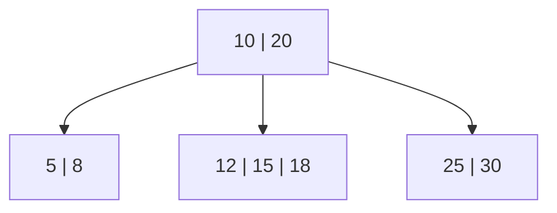

# B-Trees

## Definition

A **B-tree** is a self-balancing search tree where each node can hold multiple keys and multiple children, instead of just one key and two children like a binary search tree (BST). Think of it as a BST that got "fattened" — each node stores a sorted list of keys, and between each pair of keys sits a pointer to a child subtree containing only the values in that range.

A B-tree of **order m** follows these rules:

- Every node holds between `⌈m/2⌉ - 1` and `m - 1` keys (the root is exempt from the minimum).
- A node with `k` keys has exactly `k + 1` children.
- Keys inside a node are kept sorted.
- The child between `key[i]` and `key[i+1]` contains only values that fall between those two keys.
- **Every leaf sits at exactly the same depth.** This is the property that matters most — the tree can't degenerate into something slow, the way an unbalanced BST can when you insert sorted data.

## Why They Exist

A binary search tree gives you `O(log₂ n)` height, which looks great on paper. The problem is *what a "step" costs*. In a BST, each step down the tree is a separate node, and if that tree lives on disk (which is exactly the situation databases and filesystems are in), each step can mean a random disk read. A million rows means roughly 20 levels of BST — 20 potential disk seeks for a single lookup.

B-trees fix this by packing many keys into a single node, sized to match a disk page (commonly 4–16 KB). Now one disk read pulls in dozens or hundreds of keys at once, and the tree's height collapses — a few levels instead of twenty, even with millions of entries. The trade is more comparisons per node in exchange for far fewer node visits, which is the right trade when a node visit is expensive and a comparison is cheap.

## Structure

A small example: a root with two keys splits the world into three ranges, each handled by a child node.

- Looking for `14`? Compare against the root's keys: `14` is between `10` and `20`, so descend into the middle child.
- Looking for `7`? It's less than `10`, so descend into the left child.

Within a single node, once you're deciding *which child to descend into*, that's just binary search over a short sorted list — this is the one place binary search actually shows up in a B-tree.

## Core Operations

**Search** — start at the root, binary-search the keys in the current node to find the right child (or the key itself), repeat until you hit a leaf or find the key. Cost: `O(log n)`, but with a much smaller constant than a BST because the tree is so much shorter.

**Insertion** — insert into the correct leaf. If that leaf now has more keys than the order allows, it **splits**: the middle key gets pushed up into the parent, and the node divides into two. If the parent overflows too, the split cascades upward. This is the key mechanism that keeps every leaf at the same depth — the tree grows by adding a new root when the old root splits, not by extending a branch downward the way a BST does.

**Deletion** — remove the key, then if a node drops below the minimum key count, either borrow a key from a sibling or merge with one. More fiddly than insertion, but same underlying idea: rebalance locally, propagate upward only if necessary.

## B-Trees vs B+ Trees

Most real-world database indexes actually use a **B+ tree**, a close variant worth knowing:

| | B-tree | B+ tree |
|---|---|---|
| Data storage | Any node can hold data/record pointers | Only leaf nodes hold data/record pointers |
| Internal nodes | Store keys + data | Store keys only (pure routing) |
| Leaves | Not linked | Linked together in a list |
| Range queries | Requires tree traversal | Fast — walk the leaf-level linked list |

The leaf-linking is the big one: it makes range scans (`WHERE age BETWEEN 20 AND 30`, `ORDER BY`) cheap, because once you find the start of the range you just walk sideways instead of re-descending the tree. This is why B+ trees, not plain B-trees, are the default for database indexes.

## Use Cases

- **Database indexes** — MySQL/MariaDB (InnoDB), PostgreSQL, Oracle, SQL Server all use B+ tree variants for primary and secondary indexes. In InnoDB specifically, the primary key index is *clustered* — the leaf nodes contain the actual row data, not just a pointer to it. Secondary indexes store the indexed column plus the primary key, requiring a second lookup to fetch the full row.
- **Filesystems** — NTFS, HFS+/APFS, and ReiserFS use B-tree or B+ tree variants to organize directory entries and file metadata for fast lookups on disk.
- **General-purpose ordered key-value stores** — anywhere you need sorted data with efficient point lookups *and* range scans, backed by block-based storage.

## Prerequisites

To follow this comfortably, you should already be solid on:

- **Binary search trees** — the concept of branching based on sorted comparisons.
- **Big-O notation** — enough to compare `O(log n)` vs `O(n)` and reason about why height matters.
- **Basic tree terminology** — node, root, leaf, height, depth, subtree.
- **Recursion** — search, insert, and delete are all naturally recursive (or iterative-with-a-stack) operations.
- *(Helpful but optional)* — a basic sense of how disk I/O works and why random access is slow compared to sequential access. This is the "why" behind the whole design, not strictly required to understand the mechanics.

## Related / Next Topics

- **B+ trees** — the variant almost every real database actually uses (see above).
- **LSM trees** — the main alternative to B-trees for write-heavy storage engines (used by RocksDB, Cassandra, LevelDB). Worth comparing once B-trees are solid, since the trade-offs are almost opposite.
- **Red-black trees / AVL trees** — the in-memory, binary-node cousins of B-trees. Useful for understanding self-balancing in general before or after B-trees.